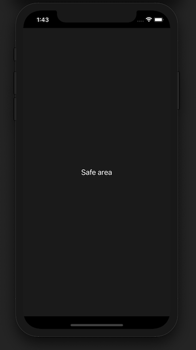

# react-native-normalized-view

normalized safe area view with keyboard avoiding view and status bar configuration

<p align="center">
  
</p>

## Installation

```sh
npm install react-native-normalized-view
```

## Usage

```js
import NormalizedView from "react-native-normalized-view";
```

see `example/src/App.tsx`

## Properties
| Prop  | Default  | Type | Description |
| :------------ |:---------------:| :---------------:| :-----|
| backgroundColor | `#ffffff` | `string` | background color behind the safe area |
| statusBarStyle | `light-content` | `'light-content' \| 'default' \| 'dark-content'` | see react-native `StatusBar` `barStyle` Prop |
| keyboardBehavior | `padding` | `'padding' \| 'height' \| 'position'` | see react-native `KeyboardAvoidingView` `behavior` Prop |


## License

MIT
